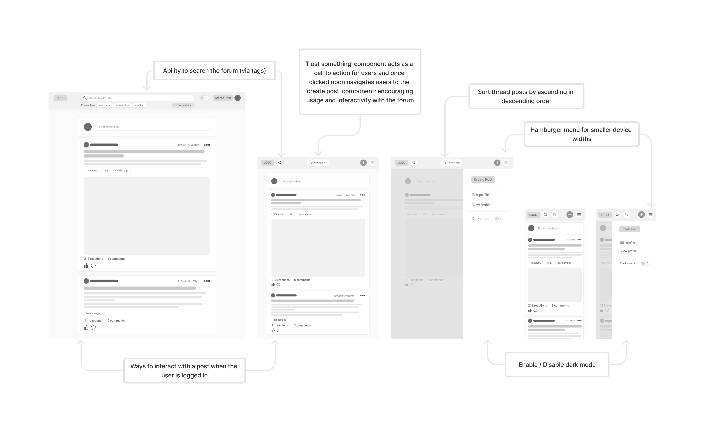
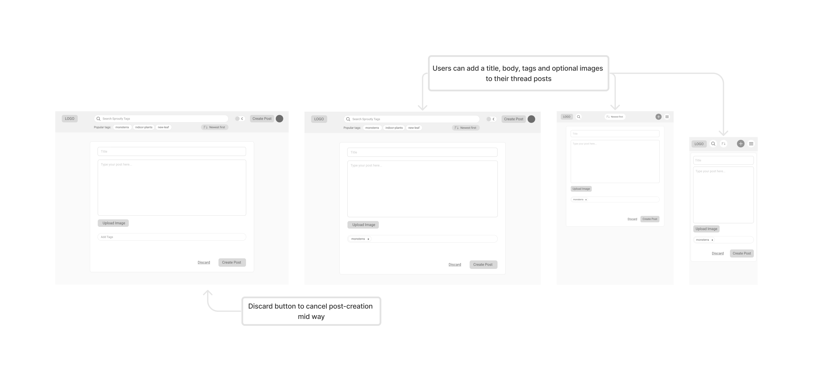
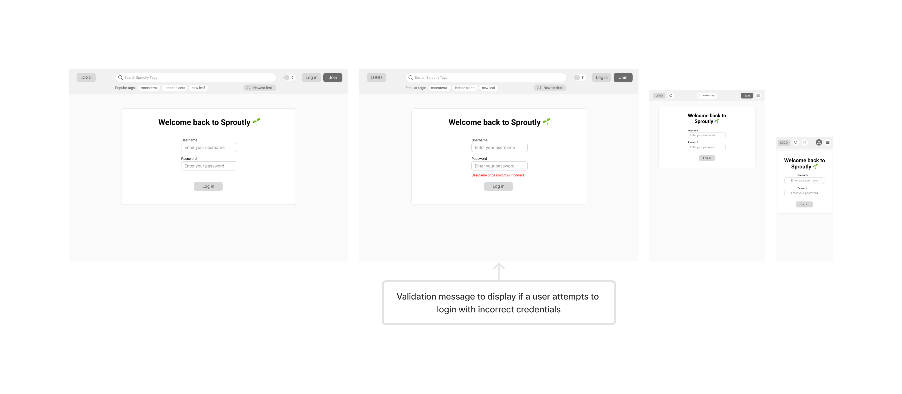
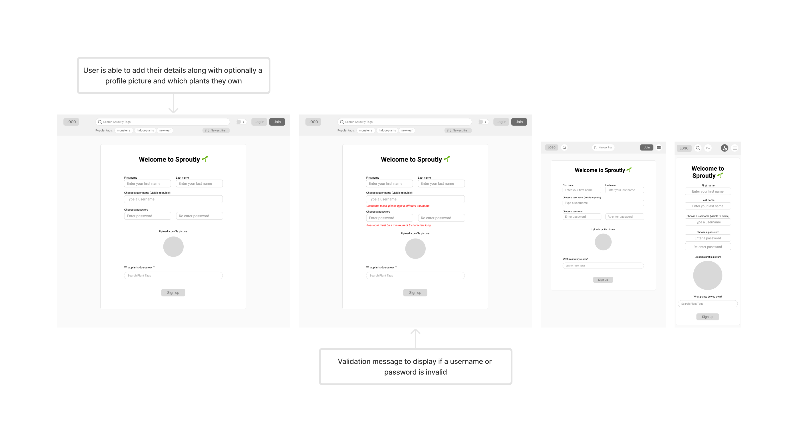
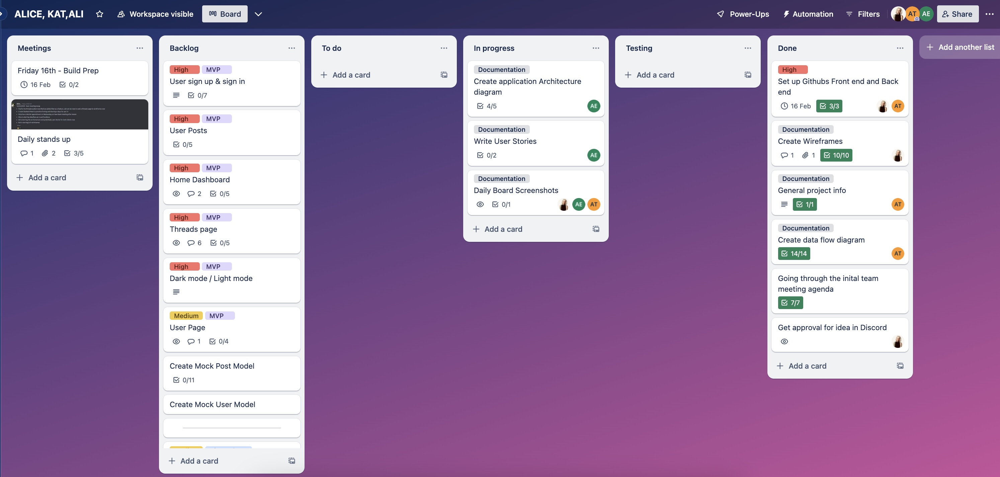

# Sproutly 🌱

A full stack web application by **Alice Tram, Katrice Mountford & Ali Eideh**

## Links
- [Backend Github Repo](https://github.com/alicetra/Plant-Forum-Backend)
- [Frontend Github Repo](https://github.com/kvtrice/sproutly-frontend)

# Table of Contents
- [General](#general)
    - [Purpose](#purpose)
    - [Functionality and Features](#functionality-and-features)
    - [Target Audience](#target-audience)
    - [Tech Stack](#tech-stack)
- [Dataflow Diagrams](#data-flow-diagrams)
- [Application Architecture Diagram](#application-architecture-diagram)
- [User Stories](#user-stories)
- [Wireframes](#wireframes)
- [Development Plan (Trello Board)](#trello-board)
- [References](#references)

# General

## Purpose

Plant enthusiasts currently engage in fragmented online communities focused on various plant-related topics. However, there isn’t a dedicated platform that serves as a comprehensive hub for all things plants, similar to how Goodreads caters to book enthusiasts or IMDB to movie lovers. 

Through research and our own experience, many plant-lovers follow multiple different Facebook groups (such as ‘Plant Identification Australia’ or ‘Plant lovers Melbourne Victoria’) and then they also participate in forums in other places such as reddit (for example: r/houseplants and r/UrbanJungle). Based on this it's clear that people want to be able to talk about their plants and discuss plant-related topics, but they have to go to various other platforms in order to do so (facebook, reddit etc.), wouldn't it be easier if this could be done from a single platform?

Sproutly is a solution to this problem, providing a unified forum platform where people can share their love of plants, ask questions and get plant help when they need it from others in the community.

## Functionality and Features
**Login and Sign up**
- New users are able to create a new account/profile
- Existing users are able to log in to their existing account using their username and password

**User Data**
- Users that are logged in are able to view and update their account details (name, username, password, profile picture) as well as delete their account.
- Users that are logged in will be able to have a unified view of their previous post and comment history.

**Thread Posts and Comments**
- Users that are logged in are able to start a thread through **creating a new post** with a title, content body and optional image
- Users that are logged in are able to comment on threads (content body). If a user is not logged in they are unable to comment on thread posts.
- All users (logged in or not logged in), will be able to **view** threads and their associated comments and images
- Users that are logged in are able to **edit** and **delete** their own comments and thread posts.
- All users are able to view the number of comments currently on a thread post.

**Search and filtering**
- All Users ware able to search threads universally by tags.
- All users are able to filter their homepage by date. This will be a limited choice between either ascending or descending order. This functionality also extends to comments on thread posts.

**Reactions**
- Users that are logged in are able to react (e.g. 'like') to comments and thread posts.
- All users are able to view the number of reactions on a given thread post or comment.

**Infinite scroll**
- To enahnce the user experience we will implement an infinite scroll feature on the user home page rather than pagination. This is in line with current industry standards and is a common user flow in similar applications in the market today.

## Target Audience

Given our purpose, our application is targeted towards those in the plant community, but additionally aimed towards Millennial and Gen-Z users.

In the past caring for plants was largely a hobby loved by older generations, and many platforms or forums that exist today are aimed towards that demographic. However since the COVID pandemic a younger audience has started to develop a love for plants, with a study by CivicScience showing that 21% of millenial and gen-z cohorts identify as 'plant parents'. 

For this reason, along with the fact that both groups are highly active and engaged in online communities in general, Sproutly will be aimed towards those aged roughly between 18 - 40. In order to make our application attractive to our target audience we're going to place a high emphasis on bold and bright colours, modern UI components, interactivity and accessibility.

## Tech Stack

We will be using the MERN stack to create our application, which includes:

#### MongoDB
MongoDB serves as the database in the MERN stack, it's non-relational and excels at handling flexible data stored in JSON-like documents. MongoDB facilitates storage, retrieval, and manipulation of data which is crucial for our full stack applciation to work smoothly.

#### Express.js 
Express.js is a lightweight server-side framework. In particular it helps to simplify tasks such as routing, middleware handling, and request/response management. We will be using it to create our backend APIs and handle HTTP requests.

#### React
React is a frontend Javascript library that will enable us to build dynamic user interfaces. It facilitates the creation of reusable components, helps to manage state within the application, and efficiently updates the UI based on data changes. We will be using it to build our front-end web page, which will ultimately be a single-page application (SPA) where components will update without page reloads. 

#### Node.js
Node.js is a server-side JavaScript runtime that enables the running of JavaScript code outside of a web browser. It provides an event-driven, non-blocking model, making it efficient for handling asynchronous requests. Node.js will be used alongside Express.js to help develop our server-side tasks.

# Data Flow Diagrams
We developed a Level 0 Data Flow Diagram (DFD) in the context of our project to provide an overarching view of our data. This highest level DFD represents major processes, data flows, and database within the system without delving into their intricate details.

The need for flexibility drives our choice to utilize a Level 0 DFD: we aim to grasp the data flow model broadly, without fixating on specific details. This strategic approach accommodates potential changes—likely during the upcoming production phase.

**Please click on the individual pictures and zoom if at any point it is hard to read. Note that the last diagram is a SVG so open in live server to view. If you are viewing this in a laptop the full diagram might not be shown unless you click on that image.**

### Individual functions data flow system

### Overarching project dataflow 

Please note that for readability, the ouput back to user wasn't shown in this overarching diagram. Please look at the indivudal functions dataflow (above) to view that flow back to user if needed.

# Application Architecture Diagram

# User Stories

# Wireframes

All un-annotated wireframes can be found under `Wireframes/Original`

### Home Page for logged in users

The home page serves as the entry point to our website. All users will be able to view this page, however some menu items and functionality will be limited to only those that are logged in (such as reacting, commenting, edit / view profile)

**Associated user stories:**
- "As a ___ I want to __ so I can ___"

### Home page for users that aren't logged in

For users that have not signed up or are not logged in, they will still have full visibility of the forum posts and threads (so they can remain a 'browser'), but they will not be able to react to thread posts or add comments to thread posts. As such, some components and action items will be hidden from view.

**Associated user stories:**
- "As a ___ I want to __ so I can ___"

### Searching based on Tags

All users are able to search the forum based on searching for existing tags and adding the tags as search parameters. This filters the thread posts based on the selected tags for the user. One or more tags can be added to the search and the search will match to any matching tag (not *all* matching tags - it doesn't increase specificity).

**Associated user stories:**
- "As a ___ I want to __ so I can ___"

### Creating a Post

Users that are logged in will be able to create a thread post, either from the 'post something' homepage component or via the 'create post' button in the nav bar; both of which navigate to this create post component.

**Associated user stories:**
- "As a ___ I want to __ so I can ___"

### Discarding a post

Users can discard a thread post if they no longer wish to continue; this will prompt for confirmation from the user before it is actioned.

**Associated user stories:**
- "As a ___ I want to __ so I can ___"

### Viewing threads

All users are able to view threads, however 'browsers' have limited actions outside of 'viewing'.

**Associated user stories:**
- "As a ___ I want to __ so I can ___"

### Commenting on threads

If the user is logged in, they are able to add new comments, edit comments and delete comments on thread posts.

**Associated user stories:**
- "As a ___ I want to __ so I can ___"

### User login

The login page is where an existing user can enter their credentials to log back into their user account. This page can be accessed from the 'login' button in the navbar.

**Associated user stories:**
- "As a ___ I want to __ so I can ___"

### User sign up

The signup page is where a new user can create a new account for Sproutly. This page can be accessed from the 'Join' button in the navbar.

**Associated user stories:**
- "As a ___ I want to __ so I can ___"

### User edit profile

Logged in users are able to edit their user details through clicking either the profile picture icon (desktop) or the 'edit profile' button in the nav bar.

**Associated user stories:**
- "As a ___ I want to __ so I can ___"

### User view profile

All users are able to view another users public profile through clicking on their username (via a thread post or comment). If a user is logged in, they are also able to navigate to view their own public profile through clicking on the profile picture icon (desktop) or the 'view profile' button in the nav bar. 

**Associated user stories:**
- "As a ___ I want to __ so I can ___"

# Trello Board

Link to live board

### Monday 12 Feb

### Tuesday 13 Feb

### Wednesday 14 Feb

# References 
GeeksforGeeks. (n.d.). Levels in Data Flow Diagrams (DFD). Available at: https://www.geeksforgeeks.org/levels-in-data-flow-diagrams-dfd/

Revitsky, L. (2020). Gen Z Houseplant Ownership Stems from the Desire to Care for Something Alive. [online] CivicScience. Available at: https://civicscience.com/gen-z-houseplant-ownership-stems-from-the-desire-to-care-for-something-alive/.

Starbuck, L. (2022). Houseplants boomed during the pandemic. Gen Z and Millennials say the popularity is here to stay. [online] KUNR Public Radio. Available at: https://www.kunr.org/business-and-economy/2022-12-28/houseplants-boomed-during-pandemic-gen-z-millennials-say-popularity-stays-tiktok.
