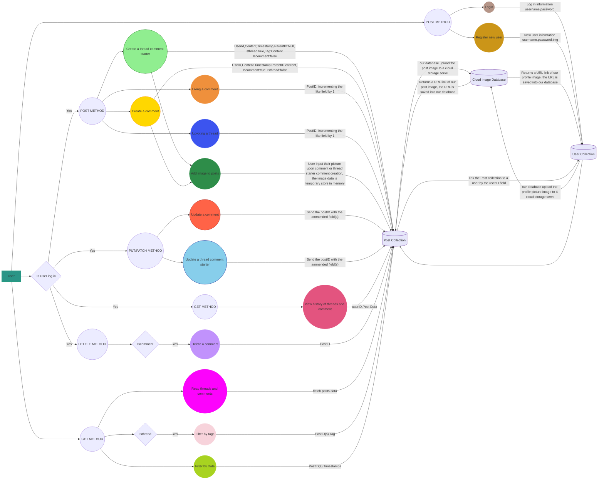

```mermaid
flowchart LR
    DB[(Post Collection )]
    Read((Read threads and comments))
    FilterT((Filter by tags))
    FilterD((Filter by Date))
    threadPost((Create a thread comment starter))
    commentPost((Create a comment))
    Likingc((Liking a comment))
    LikingT((Upvoting a thread))
    User[User]
    GET((GET METHOD))
    POST((POST METHOD))
    DBi[(Cloud image Database )]
    image((Add image to posts))
    PUT((PUT/PATCH METHOD))
    commentupdate((Update a comment))
    threadupdate((Update a thread comment starter))
    DELETE((DELETE METHOD))
    Deletecomment((Delete a comment))
    DBU[(User Collection )]
    Login((Login))
    Register((Register new user))
    POSTU((POST METHOD))
    GETU((GET METHOD))
    commentthread((View history of threads and comment))


    style DBU fill:#E6E6FA,stroke:#4B0082
    style DB fill:#E6E6FA,stroke:#4B0082
    style Read fill:#fc03fc,stroke:#e009e0
    style User fill:#2A9586,stroke:#16A372
    style FilterT fill:#F7D3DB,stroke:#F7D3DB
    style FilterD fill:#A8D320,stroke:#A8D320
    style threadPost fill:#90EE90,stroke:#006400
    style commentPost fill:#FFD700,stroke:#FF8C00
    style Likingc fill:#EF903C,stroke:#EF903C
    style LikingT fill:#3C54EF,stroke:#3C54EF
    style DBi fill:#E6E6FA,stroke:#4B0082
    style image fill:#2E8D49,stroke:#2E8D49
    style commentupdate fill:#FF6347,stroke:#8B0000
    style threadupdate fill:#87CEEB,stroke:#000080
    style Deletecomment fill:#C192FC,stroke:#C192FC
    style Login fill:#B59588,stroke:#B59588
    style Register fill:#CB9518,stroke:#CB9518
    style commentthread fill:#E3547F,stroke:#E3547F


User --> B{Is User log in}
B --> |Yes|POST
B --> |Yes|PUT
B --> |Yes|DELETE
B --> |Yes|GETU
POST-->threadPost
POST --> commentPost
POST --> Likingc
POST --> LikingT
PUT --> commentupdate
PUT-->threadupdate
DELETE --> D
GETU-->commentthread

User--> POSTU
POSTU-->Login
POSTU-->Register


Login--Log in information username,password,--->DBU
DBU -- our database upload the profile picture image to a cloud storage serve ---> DBi
Register--New user information username,password,img--->DBU
DBi -- Returns a URL link of our profile image, the URL is saved into our database ---> DBU


threadPost --> image
commentPost --> image
threadPost -- UserId,Content,Timestamp,ParentID:Null, Isthread:true,Tag:Content, Iscomment:false---> DB
commentPost -- UseID,Content,Timestamp,ParentID:content, Iscomment:true, Isthread:false---> DB
Likingc -- PostID, incrementing the like field by 1 ---> DB
LikingT -- PostID, incrementing the like field by 1 ---> DB
image -- User input their picture upon comment or thread starter comment creation, the image data is temporary store in memory ---> DB
DB -- our database upload the post image to a cloud storage serve ---> DBi
DBi -- Returns a URL link of our post image, the URL is saved into our database ---> DB
commentupdate -- Send the postID with the ammended field(s)--->DB
threadupdate -- Send the postID with the ammended field(s)--->DB


commentthread-- userID,Post Data -->DB


D{Iscomment}-->|Yes|Deletecomment
Deletecomment -- PostID---> DB


DB-- link the Post collection to a user by the userID field -->DBU
DBU---->DB

User--> GET
GET --> Read
GET --> C
GET --> FilterD


Read -- fletch posts data---> DB
C{Isthread}-->|Yes|FilterT
FilterT--PostID(s),Tag--->DB
FilterD--PostID(s),Timestamps--->DB


```