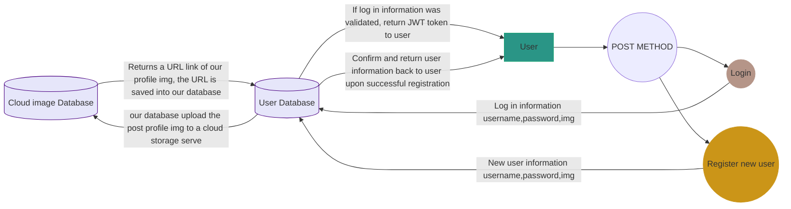

```mermaid
flowchart LR

    DBi[(Cloud image Database )]
   


    DB[(User Database )]
    Login((Login))
    Register((Register new user))
    POST((POST METHOD))
    User[User]
   
    style DB fill:#E6E6FA,stroke:#4B0082
    style Login fill:#B59588,stroke:#B59588
    style Register fill:#CB9518,stroke:#CB9518
    style User fill:#2A9586,stroke:#16A372
   style DBi fill:#E6E6FA,stroke:#4B0082


User-->POST
POST-->Login
POST-->Register


Login--Log in information username,password,img--->DB
Register--New user information username,password,img--->DB


DB--If log in information was validated, return JWT token to user--->User
DB--Confirm and return user information back to user upon successful registration--->User


DB -- our database upload the post profile img to a cloud storage serve ---> DBi
DBi -- Returns a URL link of our profile img, the URL is saved into our database ---> DB


```